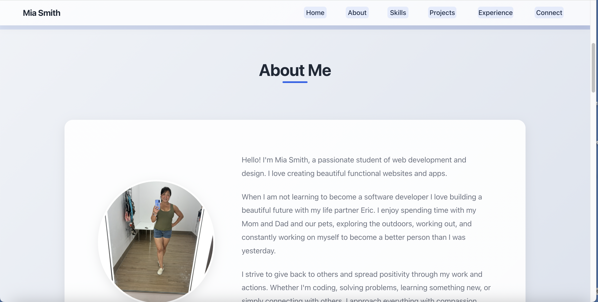

# Mia Smith's Portfolio

A modern, responsive web development portfolio showcasing my journey, skills, and projects in software development.

[](https://miasmith81.github.io/mia-smith-luna/)
[](https://opensource.org/licenses/MIT)

<div align="center">
  
</div>

## ✨ Portfolio Preview

The screenshot above showcases the modern, clean design of my portfolio website. It features a responsive layout, smooth animations, and a professional color scheme that creates an engaging user experience.

## Project Status
[](https://github.com/miasmith81/mia-smith-luna)
[](https://github.com/miasmith81/mia-smith-luna/commits/main)
[](https://github.com/miasmith81/mia-smith-luna/issues)
[](https://miasmith81.github.io/mia-smith-luna/)

## Technologies Used

### Core Skills
[](https://developer.mozilla.org/en-US/docs/Web/HTML)
[](https://developer.mozilla.org/en-US/docs/Web/CSS)
[](https://developer.mozilla.org/en-US/docs/Web/JavaScript)

### Development Environment
[](https://code.visualstudio.com/)
[](https://git-scm.com/)
[](https://github.com/)

### Learning Resources
[](https://developer.mozilla.org/)
[](https://www.freecodecamp.org/)
[](https://www.codethedream.org/)

## Overview

This portfolio website is built with modern web technologies and best practices, featuring a responsive design, glassmorphism effects, and smooth animations. It showcases my skills, experience, and projects while providing an easy way for potential collaborators to connect with me.

## Features

- 🎨 Modern, minimalist design with glassmorphism effects
- 📱 Fully responsive layout for all device sizes
- ⚡ Optimized performance and accessibility
- 🌗 Clean typography and visual hierarchy
- 🎭 Smooth animations and transitions
- 🔍 SEO-friendly structure
- 📊 Interactive project showcases

## Technologies Used

### Core Technologies
- HTML5 (Semantic markup, accessibility best practices)
- CSS3 (Modern layouts, animations, responsive design)
- JavaScript (Basic DOM manipulation and interactivity)

### Development Tools
- Visual Studio Code (Primary code editor)
- GitHub (Version control and project hosting)
- Git (Version control system)

### Key Features Implemented
- Semantic HTML structure
- Responsive CSS layouts
- Modern CSS features (Flexbox, Grid, Variables)
- Basic JavaScript interactivity
- Mobile-first design approach
- Performance optimization

### AI & Automation Tools
In the spirit of digital transparency, these AI tools were used to enhance development:
- GitHub Copilot (Code suggestions)
- Claude AI (Documentation assistance)
- Google Bard (Research assistance)

## Project Structure

```
mia-smith-luna/
├── assets/           # Images and media files
├── css/             # Stylesheets
│   └── styles.css   # Main stylesheet
├── index.html       # Main HTML file
└── README.md        # Documentation
```

## Setup and Installation

1. Clone the repository:
   ```bash
   git clone https://github.com/miasmith81/mia-smith-luna.git
   ```
2. Navigate to the project directory:
   ```bash
   cd mia-smith-luna
   ```
3. Open `index.html` in your browser or use a local server.

## Resources & Credits

### Design Resources
- [Google Fonts](https://fonts.google.com/) - Merriweather font
- [Hero Icons](https://heroicons.com/) - UI icons
- [Unsplash](https://unsplash.com/) - Stock images

### Learning Resources
- [MDN Web Docs](https://developer.mozilla.org/)
- [CSS-Tricks](https://css-tricks.com/)
- [Code The Dream](https://codethedream.org/)
- [The Last Mile](https://thelastmile.org/)

### Code References
- [CSS Grid Guide](https://css-tricks.com/snippets/css/complete-guide-grid/)
- [Flexbox Guide](https://css-tricks.com/snippets/css/a-guide-to-flexbox/)
- [Modern CSS Reset](https://piccalil.li/blog/a-modern-css-reset/)

## Acknowledgments

Special thanks to:
- Eric 'Hunter' Petross (Mentor)
- Code The Dream (Educational Support)
- The Last Mile (Training Program)
- Open Source Community

## Contributing

While this is primarily a personal portfolio, suggestions and feedback are welcome:

1. Fork the repository
2. Create a feature branch: `git checkout -b feature/YourFeature`
3. Commit changes: `git commit -am 'Add YourFeature'`
4. Push to the branch: `git push origin feature/YourFeature`
5. Submit a Pull Request

## License

This project is licensed under the MIT License - see the [LICENSE](LICENSE) file for details.

## Contact

- GitHub: [@miasmith81](https://github.com/miasmith81)
- WhatsApp: [Contact Me](https://wa.me/4064318114)

---

Created with ❤️ by Mia Smith | Last Updated: August 2025